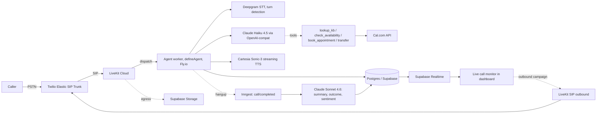
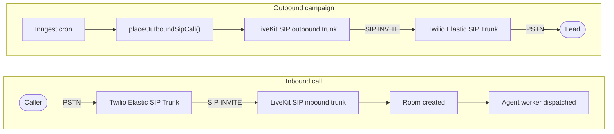

# Relay

Voice AI receptionist for service businesses. A clinic, consultório, or service provider configures a voice agent, points a phone number at it, and the agent answers calls 24/7: qualifying leads, scheduling appointments, transferring to a human when needed. Operators watch each call happen live in the dashboard with streaming transcript and a per-leg latency meter.

- Live demo: TODO
- API docs: TODO
- Loom walkthrough: TODO

## What it does

A clinic admin signs up, creates an organization, and configures an agent: persona prompt, voice, business hours, and a knowledge base of FAQs. They point a Twilio number at the SIP trunk and they're done.

A caller dials in. Roughly half a second after they finish speaking, the agent responds in a natural voice. While the call is in progress:

1. A live waveform pulses to incoming audio.
2. The transcript fills in token-by-token with speaker labels on each turn.
3. A latency meter shows STT, LLM TTFT, TTS TTFA, and end-to-end p95 in real time, with each leg colored red if it exceeds its budget.
4. Any tool the agent invokes (check availability, look up FAQ, book appointment, transfer) appears in an inline timeline with input, output, and duration.

The receptionist can take over the call from the dashboard at any moment.

When the call hangs up, an Inngest job pulls the recording and asks Claude Sonnet 4.6 to produce a structured summary, classify the outcome (`SCHEDULED` / `QUALIFIED` / `TRANSFERRED` / `NOT_QUALIFIED` / `NO_ANSWER`), score sentiment, and extract topics. The detail page shows the recording in a scrub-able player with the transcript highlighting the currently-spoken segment.

The same dashboard ships outbound campaigns (CSV upload, working-hour respect, retries with cooldown), an analytics page (volume, conversion, latency p95, weekday-by-hour heatmap), and a Cal.com integration for booking appointments mid-call.

## Pillars

### Real-time voice pipeline

- Twilio terminates the PSTN call and bridges it into LiveKit Cloud over SIP.
- A long-lived Node worker joins the LiveKit room and runs the conversation loop. The worker is deployed separately from the Next.js app, since Vercel functions cannot keep a websocket open for a 10-minute call.
- Deepgram handles STT, VAD, and turn-detection in one streaming API. End-of-turn events fire the LLM, eliminating the 150-300 ms variance of separate VAD + silence-timer pipelines.
- Claude Haiku 4.5 runs the conversation. Streamed tokens are split sentence-by-sentence and handed to Cartesia Sonic-3 so audio starts playing before the LLM finishes generating.
- Tool use is native to the Anthropic SDK call. Four tools are available during the call: `check_availability`, `book_appointment`, `lookup_kb`, `transfer_to_human`. Each tool is zod-validated, recorded with input/output/duration, and the LLM continues the conversation with the tool result as a normal turn.
- Adaptive interruption / barge-in cancels in-flight LLM generation and flushes the TTS audio queue the moment the user starts speaking.
- Latency is instrumented per leg (STT finalize, LLM TTFT, LLM total, TTS TTFA, tool total, end-to-end) and written to the database for the live meter and the analytics dashboard.

### Multi-tenant B2B

Three layers of tenant isolation:

| Layer                                | Mechanism                                              | File                   |
| ------------------------------------ | ------------------------------------------------------ | ---------------------- |
| Branded TypeScript IDs at call sites | `OrgId`, `UserId`, `CallId`, etc.                      | `lib/db/types.ts`      |
| Prisma `$extends` middleware         | `getDb(orgId)` auto-injects `orgId` on every operation | `lib/db/with-org.ts`   |
| Postgres RLS                         | `is_member_of(org_id)` policy on every tenant table    | `prisma/sql/setup.sql` |

The `$extends` middleware is unit-tested in `lib/db/with-org.test.ts` with explicit cross-tenant negative cases for every operation shape (`findMany`, `create`, `createMany`, `upsert`).

Plus the rest of the B2B surface:

- Magic-link auth via Supabase, with create-org / accept-invite onboarding flows.
- Admin / member roles with last-admin protection (you can't demote or remove the only admin).
- Invite-by-link onboarding with Resend-delivered email and 7-day token expiry.
- Audit log on every mutating action.
- Service-role path for webhook handlers that need to resolve a tenant from an inbound phone number before any user is logged in.

### Post-call processing and analytics

- The worker triggers an Inngest `call/completed` event on hangup. The function loads the transcript and tool calls, asks Claude Sonnet 4.6 (quality over latency for offline analysis) to fill a structured summary, runs idempotently, and writes back to the `Call` row.
- The recording is captured by LiveKit Egress, stored in Supabase Storage, and rendered in the detail page via a scrub-able `<audio>` element synced to the transcript. Moving the playhead highlights the currently-spoken turn.
- An outbound campaign engine runs as a 1-minute Inngest cron. It scans running campaigns for leads that are eligible (working hours, cooldown elapsed, attempts not exhausted) and emits dispatch events. The dispatcher is concurrency-limited per campaign.
- The analytics page aggregates per-call metrics into a volume chart, a latency p95 histogram (the headline metric; buckets above 1000 ms render destructive-red), a weekday-by-hour heatmap, and a per-agent comparison.

## Stack

Next.js 15, TypeScript strict, Tailwind v4, shadcn/ui (new-york, zinc), Prisma 6 (adapter pattern), Supabase (Auth + Postgres + Realtime + Storage), LiveKit Agents on the worker side with the Node SDK, Twilio for PSTN, Deepgram for STT, Claude Haiku 4.5 for the live LLM and Sonnet 4.6 for offline analysis, Cartesia Sonic-3 for TTS with ElevenLabs Flash v2.5 as a premium SKU, Cal.com API key for calendar, Inngest for background jobs, Resend for transactional email, Sentry, PostHog, Vitest, Geist Sans and Mono, violet accent.

## Performance targets

The numbers below are what the architecture is designed for. They will be measured against the live deployment once services are wired up.

- End-to-end response time on a normal turn: 600 ms p50, 900 ms p95 from end-of-user-speech to first-byte-of-agent-audio.
- Time-to-first-audio after Claude starts streaming: under 100 ms (Cartesia Sonic-3 streaming with sentence-chunked input).
- Live transcript surfaces in the dashboard within 300 ms of finalization (Supabase Realtime).
- Post-call analysis on a 3-minute call: 15 to 25 seconds (one Claude Sonnet call with prompt caching warmed).
- Cross-tenant access probes: blocked at the branded-types layer, verified at the Prisma `$extends` layer, verified again at the Postgres RLS layer.

## Architecture



## Environment variables

Relay reads env vars via Next.js (`.env.local` for development, the platform's secret store for production). Same variable names in both. The "Sensitive" column tracks whether the value should be marked secret in your hosting provider. `NEXT_PUBLIC_*` values end up in the client bundle anyway, so marking them sensitive only hides them in the UI.

| Variable                                | Production                                                                 | Local (`.env.local`)            | Sensitive |
| --------------------------------------- | -------------------------------------------------------------------------- | ------------------------------- | --------- |
| `NEXT_PUBLIC_APP_URL`                   | the public origin of your deployment                                       | `http://localhost:3000`         | no        |
| `NEXT_PUBLIC_SUPABASE_URL`              | `https://<project>.supabase.co`                                            | same                            | no        |
| `NEXT_PUBLIC_SUPABASE_ANON_KEY`         | publishable key, `sb_publishable_xxx`                                      | same                            | no        |
| `SUPABASE_SERVICE_ROLE_KEY`             | secret key, `sb_secret_xxx`                                                | same                            | yes       |
| `DATABASE_URL`                          | Supabase **transaction pooler** URI + `?pgbouncer=true&connection_limit=1` | Supabase **session pooler** URI | yes       |
| `DIRECT_URL`                            | Supabase **session pooler** URI                                            | same                            | yes       |
| `ANTHROPIC_API_KEY`                     | from `console.anthropic.com`                                               | same                            | yes       |
| `ANTHROPIC_MODEL_FAST`                  | `claude-haiku-4-5-20251001`                                                | same                            | no        |
| `ANTHROPIC_MODEL_SUMMARY`               | `claude-sonnet-4-6`                                                        | same                            | no        |
| `DEEPGRAM_API_KEY`                      | from `console.deepgram.com`                                                | same                            | yes       |
| `DEEPGRAM_MODEL`                        | `nova-3`                                                                   | same                            | no        |
| `CARTESIA_API_KEY`                      | from `play.cartesia.ai`                                                    | same                            | yes       |
| `CARTESIA_MODEL`                        | `sonic-3`                                                                  | same                            | no        |
| `ELEVENLABS_API_KEY` _(premium SKU)_    | from `elevenlabs.io`                                                       | same or unset                   | yes       |
| `LIVEKIT_API_KEY`                       | from LiveKit Cloud project                                                 | same                            | yes       |
| `LIVEKIT_API_SECRET`                    | from LiveKit Cloud project                                                 | same                            | yes       |
| `LIVEKIT_URL`                           | `wss://<project>.livekit.cloud`                                            | same                            | no        |
| `LIVEKIT_SIP_OUTBOUND_TRUNK_ID`         | id of the LiveKit outbound trunk pointed at your Twilio SIP credentials    | same                            | no        |
| `LIVEKIT_SIP_OUTBOUND_TRUNK_HOST`       | Twilio Termination URI host, e.g. `<trunk>.pstn.twilio.com`                | same                            | no        |
| `CALCOM_API_BASE`                       | `https://api.cal.com/v2`                                                   | same                            | no        |
| `INNGEST_EVENT_KEY`                     | from `app.inngest.com`                                                     | from `inngest-cli dev`          | yes       |
| `INNGEST_SIGNING_KEY`                   | from `app.inngest.com`                                                     | from `inngest-cli dev`          | yes       |
| `RESEND_API_KEY`                        | sending-access key                                                         | same                            | yes       |
| `RESEND_FROM_EMAIL`                     | `onboarding@resend.dev` until you verify a domain                          | same                            | no        |
| `NEXT_PUBLIC_SENTRY_DSN` _(optional)_   | from a Sentry project                                                      | same or unset                   | no        |
| `NEXT_PUBLIC_POSTHOG_KEY` _(optional)_  | from PostHog                                                               | same or unset                   | no        |
| `NEXT_PUBLIC_POSTHOG_HOST` _(optional)_ | `https://us.i.posthog.com`                                                 | same                            | no        |

Twilio is configured as a **SIP carrier**, not via REST API. Its account credentials live inside LiveKit's outbound trunk config in the LiveKit dashboard, not in your app env. The app never calls `api.twilio.com` directly.

One value differs between local and production: **`DATABASE_URL`** uses the transaction pooler in production (every serverless invocation opens a fresh connection) and the session pooler locally (longer-lived, supports prepared statements, plays nicely on IPv4 home networks).

## Local development

Requires Node 22 and Yarn 4 via Corepack.

```bash
cp .env.example .env.local
# Fill in every key per the table above.

corepack enable                               # one-time, installs yarn 4
yarn install                                  # postinstall runs prisma generate
```

### First-time database setup

The Supabase project comes with several pre-installed extensions that show up as drift in `prisma migrate dev`. For an existing Supabase project that's never had Prisma run against it, bootstrap a baseline migration manually:

```bash
mkdir -p prisma/migrations/0_init

yarn prisma migrate diff \
  --from-empty \
  --to-schema prisma/schema.prisma \
  --script \
  > prisma/migrations/0_init/migration.sql

yarn prisma migrate deploy
```

Then apply the RLS policies and auth trigger. Either copy `prisma/sql/setup.sql` into the Supabase SQL editor and run it, or use the bundled script that connects via `DIRECT_URL`:

```bash
yarn db:rls
```

The script is idempotent and safe to re-run.

Optional demo data, "Clínica Lumen" with 60 fake calls across the last 30 days:

```bash
yarn db:seed              # skips if the demo org exists
yarn db:seed --reset      # wipes and re-creates
```

### Daily

```bash
yarn dev                  # Next.js dashboard on :3000
yarn worker:dev           # Agent worker (separate terminal)
yarn inngest:dev          # Inngest dev server (separate terminal)
```

Scripts:

```bash
yarn typecheck            # tsc --noEmit
yarn lint                 # ESLint flat config
yarn test                 # Vitest
yarn build                # Next.js production build
```

## Deploying

The Next.js app deploys to Vercel. Import the repo, leave Build / Output / Install commands empty (Vercel auto-detects yarn via the `packageManager` field), and paste your env vars from `.env.local` swapping in the production values from the table above.

The agent worker deploys separately. The included `worker/Dockerfile` targets Fly.io in `gru` (São Paulo), the region recommended for proximity to your SIP carrier's Brazil presence. Any host that supports long-lived processes works: Fly, Render, Railway, or a self-managed VM. Set the same env vars as the Next.js app.

The worker uses the built-in `@livekit/agents` job dispatch. When LiveKit Cloud creates a room (because a SIP call arrived, or the dashboard's test-call feature provisioned one), it dispatches a worker process automatically. There is no HTTP coupling between Vercel and the worker host.

### SIP routing

Relay treats Twilio (or any other SIP-capable carrier) as a **SIP carrier**, not as a Voice webhook target.



After the first deploy, configure each provider's dashboard as described below.

#### Supabase

Project creation:

- **Enable Data API**: uncheck. Relay queries through Prisma server-side; PostgREST is unused.
- **Automatically expose new tables**: uncheck (default).
- **Enable automatic RLS**: check. Defense in depth on top of `prisma/sql/setup.sql`.
- **Postgres Type**: Postgres (default), not OrioleDB.

After project exists, **Authentication, URL Configuration**: add `https://<your-deployment>` to **Site URL** and **Redirect URLs**.

Connection strings:

- `DATABASE_URL` on Vercel: **Transaction pooler** URI, append `?pgbouncer=true&connection_limit=1`.
- `DIRECT_URL` on Vercel: **Session pooler** URI.
- Both `DATABASE_URL` and `DIRECT_URL` locally: **Session pooler** URI. The Direct connection option is IPv6-only and not needed here.

#### Twilio (Elastic SIP Trunking)

Create a trunk under **Twilio Console, Elastic SIP Trunking, Trunks**.

**Features tab:**

| Setting                       | Value                                                                            |
| ----------------------------- | -------------------------------------------------------------------------------- |
| Call Recording                | Disabled (LiveKit Egress handles recording)                                      |
| Secure Trunking               | Disabled initially; enable after basic connectivity works, matching LiveKit SRTP |
| Call Transfer (SIP REFER)     | Enabled (needed by `transfer_to_human`)                                          |
| Caller ID for Transfer Target | Set caller ID as Transferee                                                      |
| Enable PSTN Transfer          | Checked                                                                          |
| Symmetric RTP                 | Enabled                                                                          |

**Termination tab:**

- Twilio auto-generates a Termination URI like `<trunk>.pstn.twilio.com`. Copy it into LiveKit's outbound trunk config.
- Assign a Credential List (created under Authentication) so LiveKit can authenticate when dialing out.

**Origination tab:**

- Add the LiveKit SIP inbound URI as the origination URI. Get it from **LiveKit Cloud, SIP**.
- Priority 10, Weight 10, Enabled.

**Numbers tab:**

- Assign every Twilio E.164 you've purchased. Each one must match what you connect in Relay's `Settings, Phone numbers`.

**Authentication tab:**

- Create one Credential List with a single credential (random username + strong password). Use it on the Termination tab. The same username/password go into LiveKit's outbound trunk config.

#### LiveKit Cloud

Under **SIP**:

- **Inbound trunk**: name `twilio-inbound`. Direction Inbound. Numbers: paste every Twilio E.164 (comma-separated). Allowed addresses: leave blank. Media encryption SRTP: Disabled (must match Twilio's Secure Trunking). Include headers: No headers.
- **Outbound trunk**: name `twilio-outbound`. Direction Outbound. Address: Twilio's Termination URI. Auth username + password: the Credential List you created in Twilio. After creating, copy the trunk id into `LIVEKIT_SIP_OUTBOUND_TRUNK_ID`.
- **Dispatch rule**: one room per call, default name `call-<sid>`.

Under **Agents**: register a dispatch rule that runs your worker on every new room.

#### Cal.com (API key)

Cal.com Platform is closed to new signups as of 2026, so OAuth Client provisioning is not an option. Use personal API keys instead. Any Cal.com account works (free, paid, personal, team).

Each org admin generates one key on their own Cal.com account:

1. In Cal.com, **Settings, Security, API Keys, Add**.
2. Set a recognizable name like `Relay`. Set an expiration (or none for the demo).
3. Copy the generated key. It starts with `cal_live_`.
4. In Relay, **Settings, Calendar, Conectar Cal.com**: paste the key and submit. Relay validates it by calling `/me` and stores it against the org.

The agent worker uses the stored key for `/event-types`, `/slots/available`, and `/bookings`. There is no OAuth dance, no redirect URI to register, and nothing to configure in env beyond `CALCOM_API_BASE` (which defaults to `https://api.cal.com/v2`).

#### Inngest

Register the app with the `/api/inngest` route URL on `app.inngest.com`. Copy the event key and signing key into the env. The campaign-tick cron will start firing once the app is registered.

The phone number you connect inside Relay (Settings, Phone numbers) must match the E.164 the carrier sends in the SIP `To` header. The worker reads this from SIP attributes on the joining participant to resolve which org and agent owns the call.

### Applying schema changes to production

The Vercel build only runs `next build`. It does not apply pending Prisma migrations. After committing a schema change locally, run from your machine:

```bash
DATABASE_URL="<value of prod DIRECT_URL>" yarn prisma migrate deploy
```

`prisma migrate deploy` applies every migration in `prisma/migrations/` that hasn't been recorded yet. The command is idempotent and atomic per migration.

## Project layout

```
app/
  (auth)/               login, signup
  (onboarding)/         create-org, accept-invite
  (app)/                authenticated shell
    dashboard/          home stats
    calls/              history list + live monitor + detail
    agents/             CRUD + persona / voice / hours / knowledge base
    campaigns/          outbound CRUD + lead board
    calendar/           Cal.com bookings overview
    analytics/          volume, latency p95, heatmap, agent comparison
    settings/           org, members, phone-numbers, calendar
  auth/                 supabase callback, signout, check-email
  api/
    webhooks/livekit/   room / participant events
    inngest/            Inngest serve handler

components/
  ui/                   shadcn primitives
  call/                 waveform, transcript stream, latency meter, audio player

hooks/
  use-realtime.ts       Supabase Realtime subscription hooks

lib/
  analytics/            aggregations for /analytics
  auth/                 session helpers (server-only)
  calendar/             Cal.com Platform API client
  db/                   Prisma client + with-org $extends + branded IDs
  email/                Resend client + invite template
  inngest/              client, post-call function, campaign-dispatch, campaign-tick (cron)
  posthog/              client + server analytics
  supabase/             server, admin (service-role), browser, middleware
  voice/                livekit (room + SIP outbound), persistence, prompts, cost
  voice/tools/          lookup-kb

prisma/
  schema.prisma         18 models
  sql/setup.sql         RLS policies + auth.users sync trigger
  seed.ts               Clínica Lumen demo data

scripts/
  apply-rls.ts          run setup.sql against DIRECT_URL

worker/                 LiveKit Agents worker (deployed separately)
  agent.ts              defineAgent({ entry }) that resolves tenant from SIP attrs,
                        wires Deepgram STT + Anthropic LLM + Cartesia TTS + Silero VAD,
                        runs the conversation loop, persists transcripts and metrics
  Dockerfile
```

## CI

Runs on every PR and on push to main. Pipeline order:

1. `prisma generate`
2. `tsc --noEmit`
3. ESLint flat config
4. Vitest
5. `next build`

## License

MIT. See [LICENSE](LICENSE).
